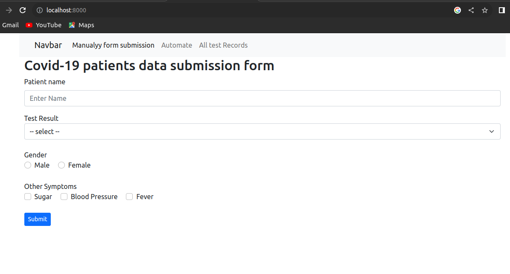
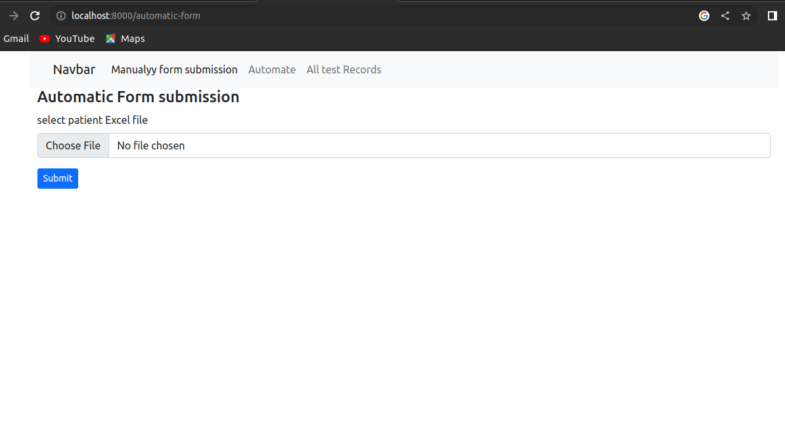
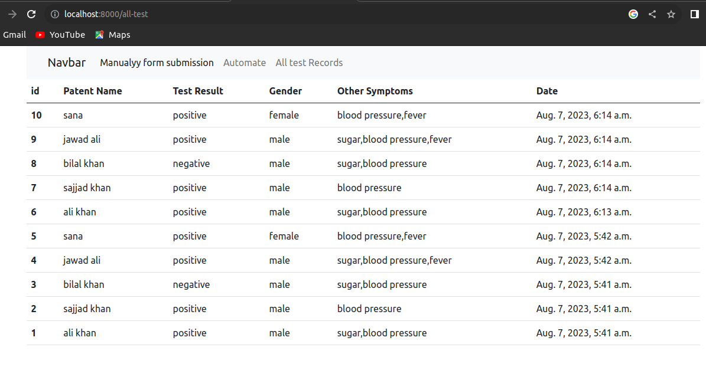

# Python Automation With Django and Selenium

# why to use python automation
on our daily life we want to submit lots of data to our website, send emails to lots of users etc, and this is very time consuming and effort full task for us. python automation is the best solution to automat our tasks to reduce our efforts and working time. Selenium is one of python package used fo python automation. 

in this project i use the quality of selenium to automat my form submission by uploading just an Excel File to the server.........

# How this application works

The use of this application is very simple. In this application we submit our forms manually as will is by using automatic form submission. in manual form submission we fill form for each record and then submit one by one. but in automatic form submission we just select our Excel file that contains our records and click on submit button. after submitting the file python will take control of all data one by one without any other interference of user.

# Manual Form Submission Form

# automatic form submission

Note!... In the Root Directory of this project a pre formatted Excel File is given for this project. Don't Use other formate otherwise form will not be submitting.

# All submitted tests 

# Requirement
1: python version >= 3.0

2: django version >= 4.0

# how to run this project  

step 1: download the project

step 2: create a virtual environment with "virtualenv myenv" command ------> this is for ubuntu

step 3: activate your virtual env by " source myenv/bin/activate " --------> this command is for ubuntu users

step 4: change directory to the project folder

step 5: pip install -r requirements.txt

step 6: python manage.py makemigrations

step 7: python manage.py migrate

step 8: python manage.py runserver